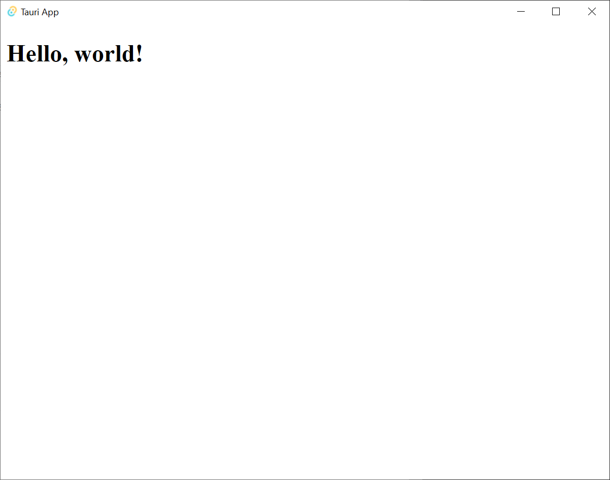

# A minimal [Tauri](https://tauri.studio/) example

It uses
- [React](reactjs.org/)
- [TypeScript](https://www.typescriptlang.org/)
- [Parcel](https://parceljs.org/getting-started/webapp/) 




## Getting started

Make sure you have [the prerequisites](https://tauri.studio/docs/getting-started/prerequisites)

To develop

```sh
yarn tauri dev
```

To build

```sh
yarn tauri build
```
